# Mini ERP Sistemi (Laravel)


Bu proje, **Laravel** framework'ü kullanılarak geliştirilmiş, modern ve modüler bir **Mini ERP (Kurumsal Kaynak Planlama)** uygulamasıdır. Küçük ve orta ölçekli işletmelerin temel süreçlerini (Stok, Satış, Satın Alma, Müşteri ve Fatura) dijital ortamda yönetmelerini sağlamak amacıyla tasarlanmıştır.

Akademik bir bitirme projesi veya kurumsal bir portföy projesi olarak, gerçek dünya senaryoları ve iş akışları (Business Logic) dikkate alınarak geliştirilmiştir.

---

## 🚀 Özellikler

### 🔐 Kimlik Doğrulama & Güvenlik
*   **Güvenli Giriş:** Standart e-posta/şifre girişi ve kayıt sistemi.
*   **Google ile Giriş:** Laravel Socialite entegrasyonu ile hızlı Google oturum açma.
*   **Rol Bazlı Yetkilendirme (RBAC):** Yönetici ve standart kullanıcı rolleri ile erişim kontrolü.
*   **Profil Yönetimi:** Kullanıcı bilgileri güncelleme ve güvenli şifre yönetimi.

### 📊 Yönetim Paneli (Dashboard)
*   **Genel Bakış:** Toplam satış, aylık gelir, aktif siparişler ve kritik stok sayıları.
*   **Grafikler:** Haftalık ve aylık satış performans grafikleri.
*   **Bildirim Merkezi:** Düşük stok, yeni sipariş ve sistem uyarıları için canlı bildirim alanı.

### 📦 Stok ve Ürün Yönetimi
*   **Ürün Kataloğu:** Ürün ekleme, düzenleme, silme ve listeleme.
*   **Kategori Yapısı:** Ürünleri kategorilere ayırma ve filtreleme.
*   **Stok Takibi:** Anlık stok miktarı görüntüleme, manuel stok girişi/çıkışı.
*   **Kritik Stok Uyarısı:** Belirlenen minimum seviyenin altına düşen ürünler için otomatik uyarılar.
*   **Fiyat Geçmişi:** Ürün fiyat değişikliklerinin loglanması ve takibi.
*   **Barkod/QR:** Ürünler için barkod altyapısı desteği.

### 👥 Müşteri İlişkileri (CRM)
*   **Müşteri Yönetimi:** Detaylı müşteri profilleri oluşturma ve düzenleme.
*   **Sipariş Geçmişi:** Müşterinin geçmiş siparişlerini ve toplam harcamasını görüntüleme.
*   **Müşteri Notları:** Müşterilerle ilgili özel notlar ekleyebilme (Örn: "Özel indirim bekliyor").
*   **Pasif Müşteri Analizi:** Uzun süredir işlem yapmayan müşterilerin tespiti.

### � Satış Yönetimi
*   **Sipariş Oluşturma:** Kullanıcı dostu arayüz ile hızlı satış siparişi oluşturma.
*   **Sepet Mantığı:** Birden fazla ürünü tek siparişte toplayabilme.
*   **Sipariş Durumları:** Bekliyor, Onaylandı, Hazırlanıyor, Teslim Edildi gibi süreç takibi.
*   **Dinamik Fiyatlandırma:** Sipariş anındaki güncel fiyatlar üzerinden hesaplama.

### 🚚 Satın Alma Yönetimi
*   **Tedarikçi Yönetimi:** Tedarikçi firma kayıtları ve detayları.
*   **Satın Alma Siparişleri:** Tedarikçilerden ürün alım süreçlerinin yönetimi.
*   **Stok Entegrasyonu:** Tamamlanan satın almalarda stok miktarının otomatik artırılması.

### 📄 Fatura ve Raporlama
*   **Fatura Oluşturma:** Satış siparişlerini tek tıkla faturaya dönüştürme.
*   **PDF Çıktısı:** Faturaları profesyonel formatta PDF olarak indirme ve görüntüleme (`dompdf` entegrasyonu).
*   **Haftalık Raporlar:** Sistemdeki hareketlerin otomatik raporlanması.

---

## � Teknoloji Yığını

*   **Backend:** Laravel 12.x, PHP 8.2+
*   **Frontend:** Blade Şablon Motoru, Tailwind CSS, Alpine.js
*   **Veritabanı:** MySQL / SQLite
*   **Build Tool:** Vite
*   **Paketler & Kütüphaneler:**
    *   `barryvdh/laravel-dompdf`: PDF fatura oluşturma için.
    *   `laravel/socialite`: Sosyal medya (Google) girişleri için.
    *   `revolution/laravel-google-sheets`: (Opsiyonel) Google Sheets entegrasyonları için.

---

## ⏱️ Scheduler / Otomasyon (Cron)

Laravel Scheduler kullanılarak aşağıdaki otomatik görevler oluşturulmuştur:

- Günlük kritik stok kontrolü
- Geciken satın alma siparişleri tespiti
- Aylık fiyat loglama
- Haftalık satış raporu oluşturma
- Pasif müşteri tespiti
- Eski bildirimlerin otomatik temizlenmesi
- Vadesi geçmiş faturaların takibi

> Laravel 10+ sürümleri için `routes/console.php` üzerinden tanımlanmıştır.

---

## ⚙️ Kurulum

Projeyi yerel ortamınızda çalıştırmak için aşağıdaki adımları izleyin.

### Gereksinimler
*   PHP >= 8.2
*   Composer
*   Node.js & NPM
*   MySQL veya SQLite

### Adım Adım Kurulum

1.  **Projeyi Klonlayın:**
    ```bash
    git clone https://github.com/kullaniciadi/mini-erp.git
    cd mini-erp
    ```

2.  **Bağımlılıkları Yükleyin (PHP & Node):**
    ```bash
    composer install
    npm install
    ```

3.  **Çevresel Ayarları Yapın:**
    `.env.example` dosyasını kopyalayarak `.env` dosyasını oluşturun.
    ```bash
    cp .env.example .env
    ```
    `.env` dosyasını açın ve veritabanı ayarlarınızı yapılandırın (DB_DATABASE, DB_USERNAME, vb.).

4.  **Uygulama Anahtarını Oluşturun:**
    ```bash
    php artisan key:generate
    ```

5.  **Veritabanını Hazırlayın:**
    Tabloları oluşturmak ve örnek verileri yüklemek için:
    ```bash
    php artisan migrate --seed
    ```

6.  **Frontend Varlıklarını Derleyin:**
    ```bash
    npm run build
    ```

7.  **Sunucuyu Başlatın:**
    ```bash
    php artisan serve
    ```
    Tarayıcınızda `http://localhost:8000` adresine giderek uygulamayı görüntüleyebilirsiniz.

---

## � Ekran Görüntüleri

1 Navigation Bar :

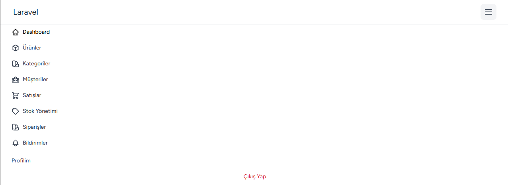

2 Dashboard :

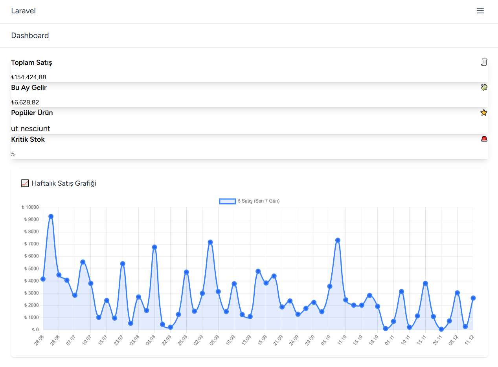

3 Ürünler : 

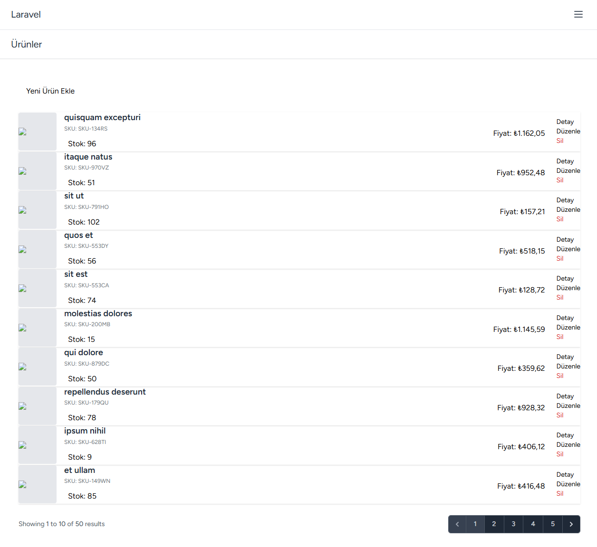

3.1 Yeni Ürün Ekle : 

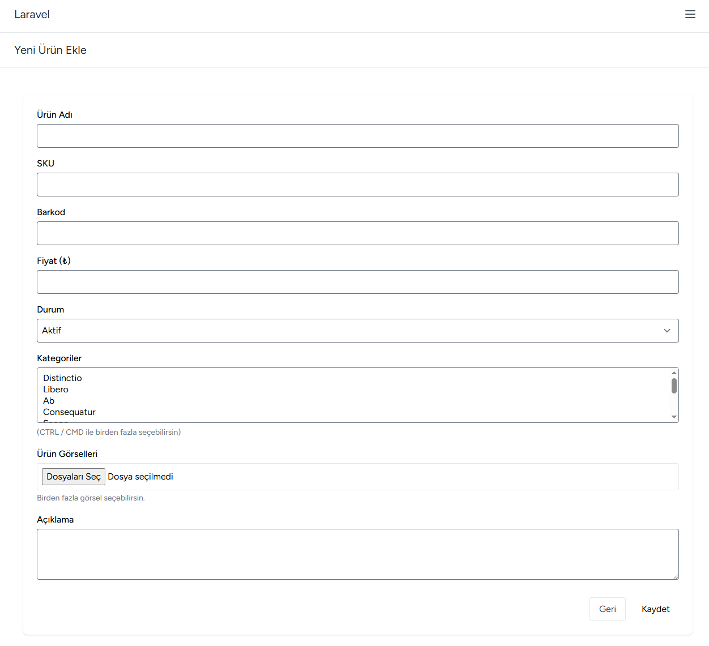

3.2 Detay : 

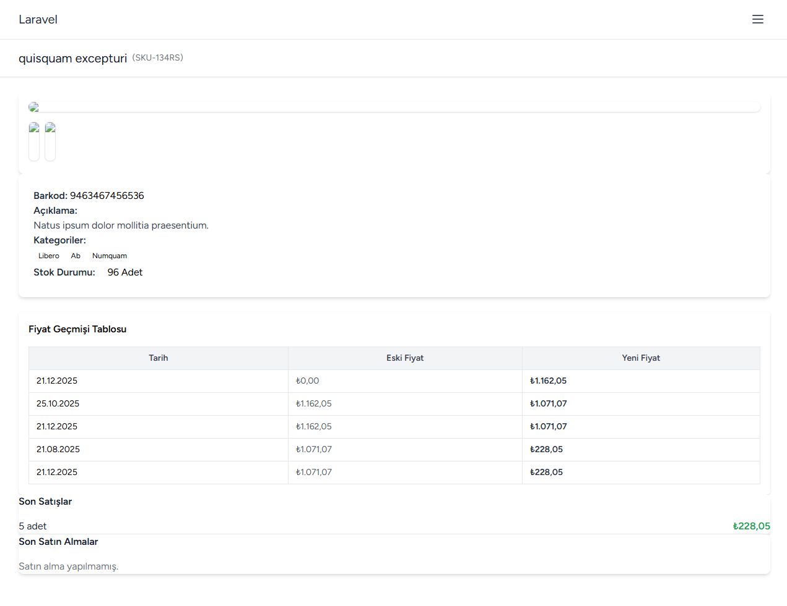

3.3 Düzenle :

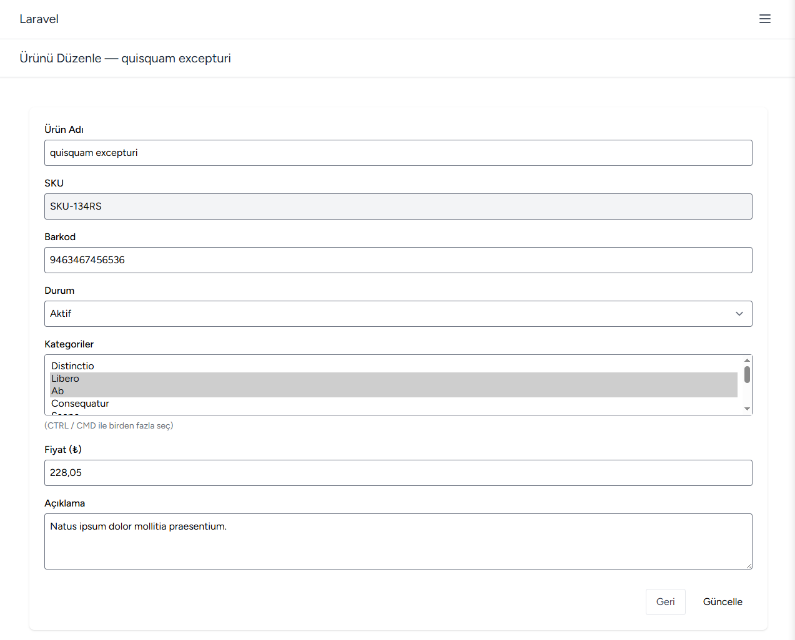

4 Kategoriler :

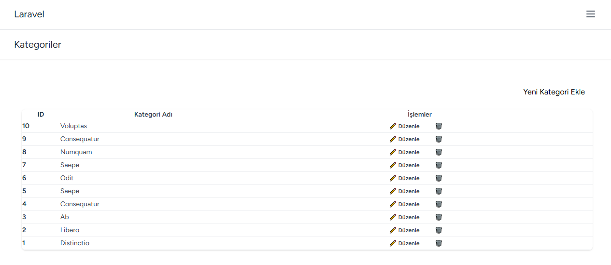

5 Müşteriler :

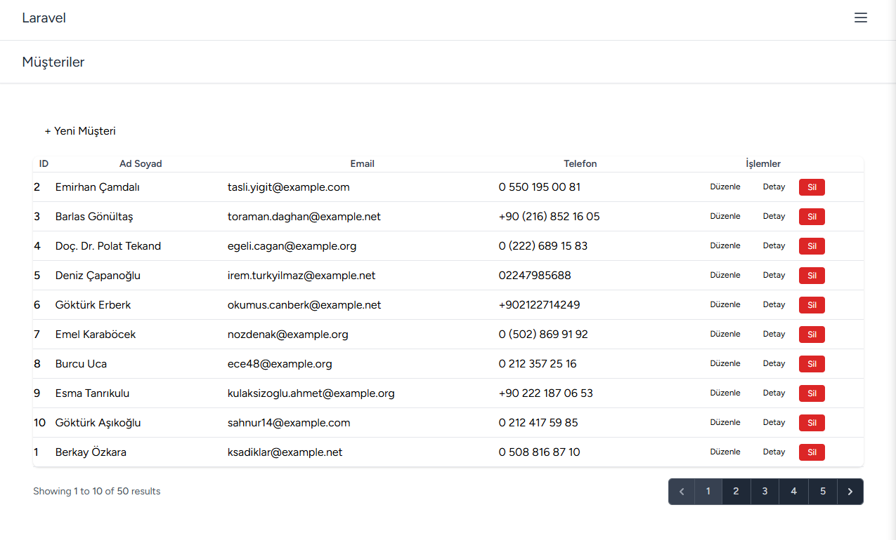

6 Satışlar :

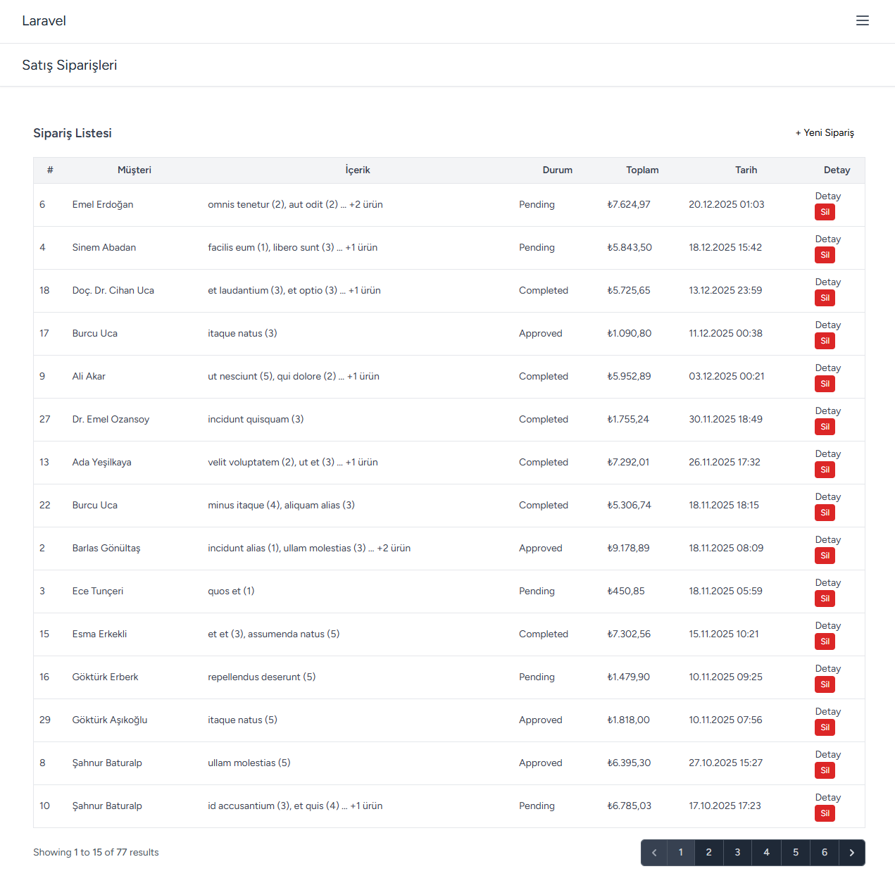

7 Stok Yönetimi :

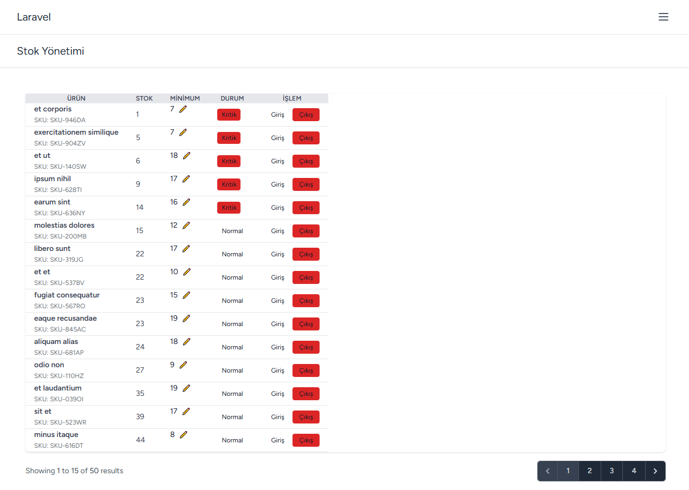

8 Siparişler : 

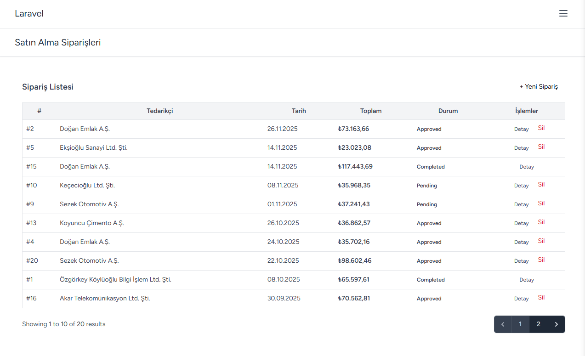

9 Bildirimler : 

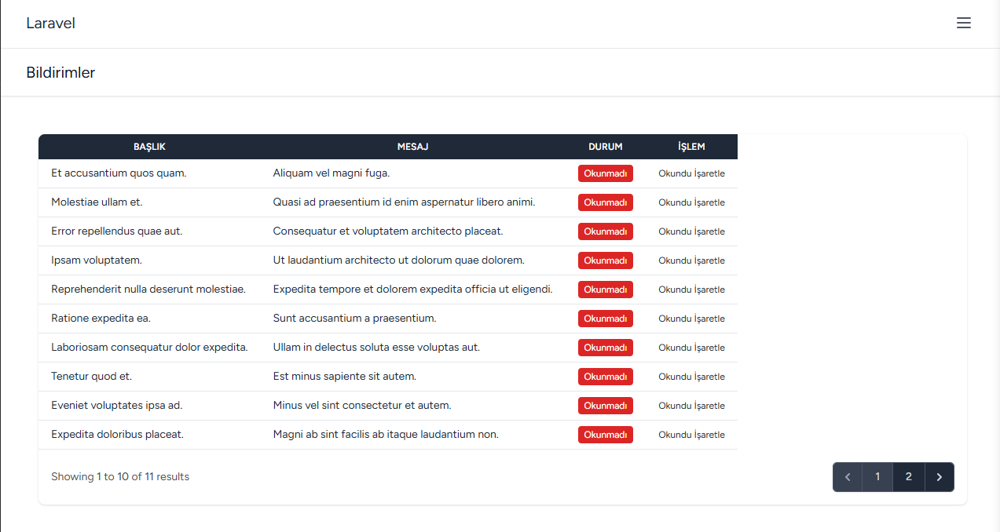


---

## 🤝 Katkıda Bulunma

1.  Bu repoyu fork edin.
2.  Yeni bir özellik dalı oluşturun (`git checkout -b feature/yeni-ozellik`).
3.  Değişikliklerinizi commit edin (`git commit -m 'Yeni özellik eklendi'`).
4.  Dalınızı push edin (`git push origin feature/yeni-ozellik`).
5.  Bir Pull Request oluşturun.

---
